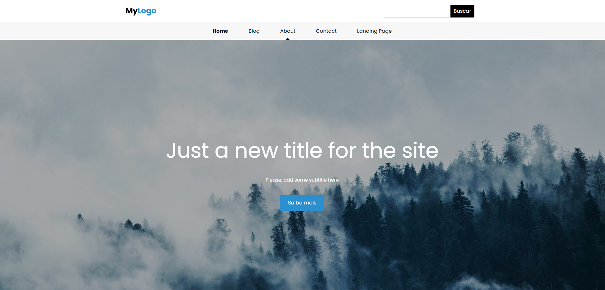
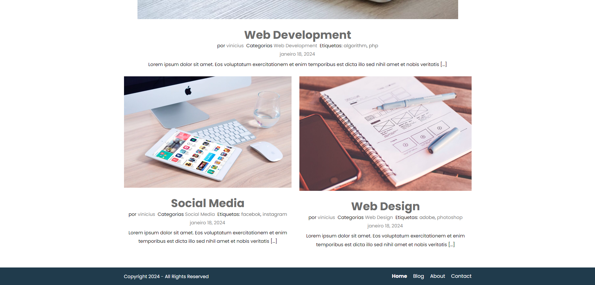
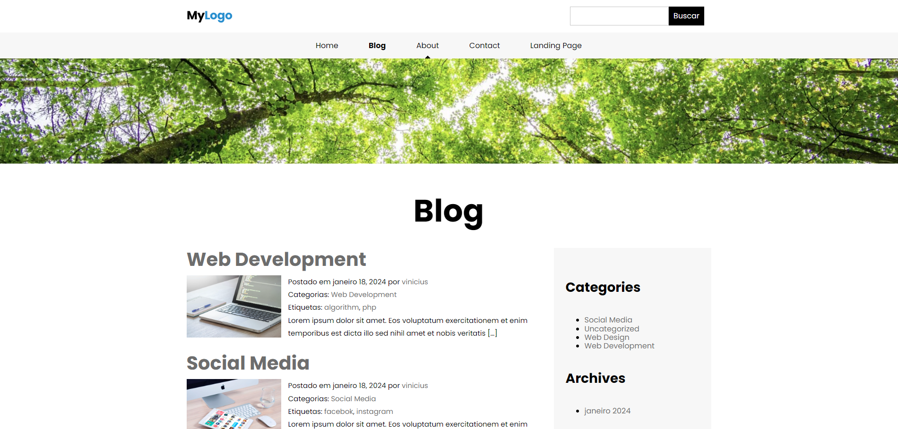
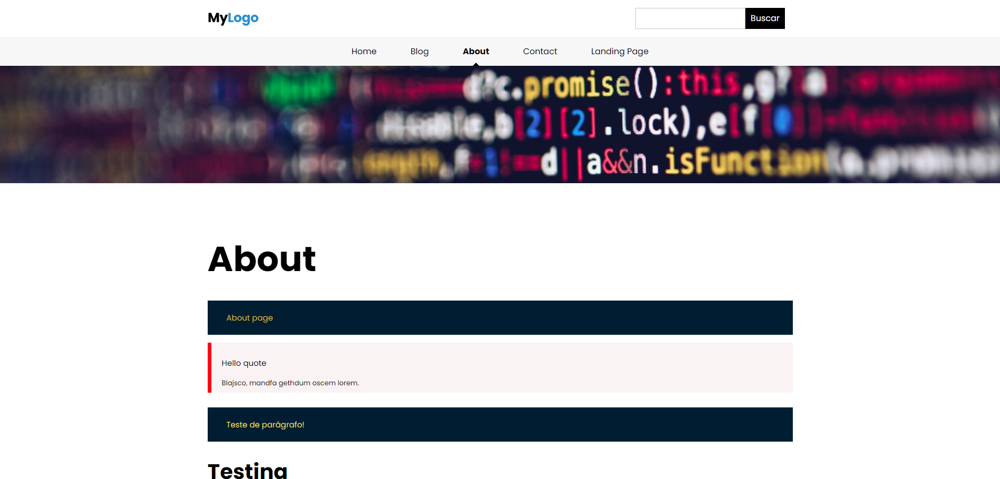

	

	<h1>Saudações</h1>
	

		Este projeto teve por objetivo a construção de um tema WordPress feito do zero, sem a ajuda de nenhum page-builder ou plugin, 
		a fim de que o tema não ficasse dependente de alguma ferramenta externa e de suas atualizações.
	

	

		Foram abordados desde os conceitos simples como arquivos de template até customização
		do tema pelo usuário, boas práticas de segurança e ainda algumas configurações do novo
		editor de blocos do WordPress.
	

	

		A estilização do tema foi totalmente desenvolvida em CSS puro e encontra-se responsivo aos diferentes tamanhos de tela.
	

	<h2>Imagens do projeto pronto:</h2>
	
HOME

	
	
HOME FOOTER

	
	
BLOG

	
	
ABOUT

	

